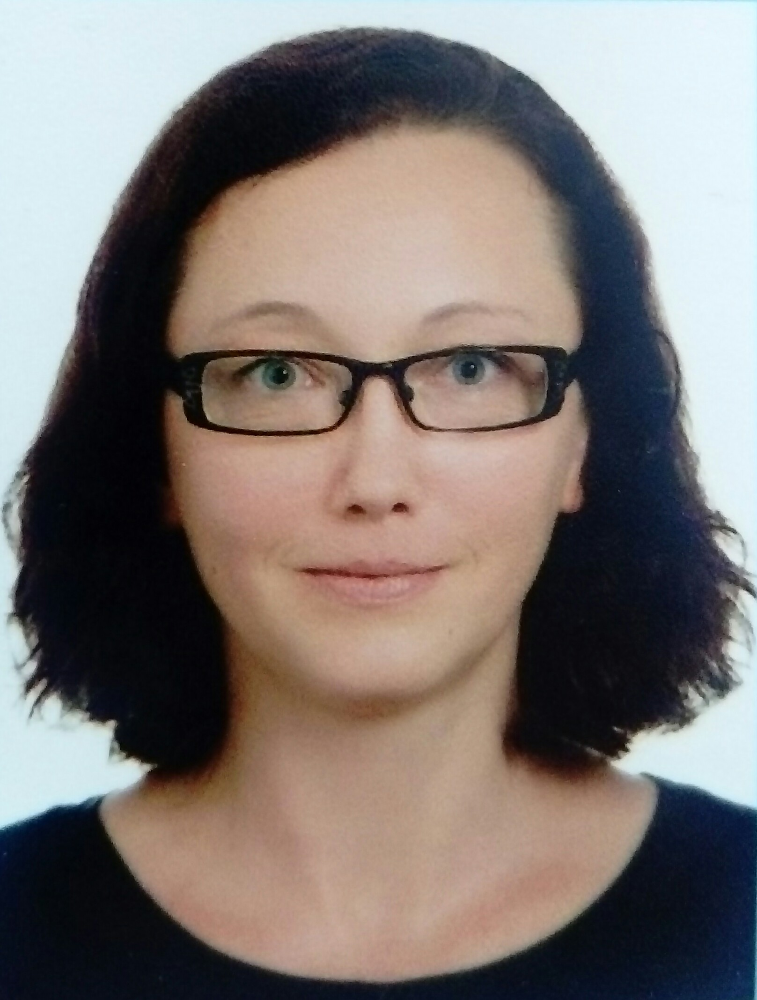

<!--- start of code for font awesome--->

<link rel="stylesheet" href="https://cdnjs.cloudflare.com/ajax/libs/font-awesome/5.11.2/css/all.css" integrity="sha256-46qynGAkLSFpVbEBog43gvNhfrOj+BmwXdxFgVK/Kvc=" crossorigin="anonymous" />
<!--- end of code for font awesome--->

```{r, include=FALSE}
knitr::opts_chunk$set(
  results='asis', 
  echo = FALSE
)

library(glue)
library(tidyverse)

# Set this to true to have links turned into footnotes at the end of the document
PDF_EXPORT <- FALSE

# Holds all the links that are inserted for placement at the end
links <- c()

source('parsing_functions.R') # Functions for building sections from CSV data
source('common_variables.R')  # Small variables for non-csv data such as intro text

# Load csv with position info
position_data <- read_csv('positions.csv')
```


```{r}
# When in export mode the little dots are unaligned, so fix that. 
if(PDF_EXPORT){
  cat("
  <style>
  :root{
    --decorator-outer-offset-left: -6.5px;
  }
  </style>")
}
```
Aside
================================================================================
{width=50%}


## Contact

- <i class="fa fa-envelope"></i> olga.lukasevich@gmail.com
- <i class="fa fa-github"></i> github.com/lukas1326
- <i class="fa fa-phone"></i> +38(067) 492 72 57

## SKILLS

- <i class="fa fa-laptop"></i> **Programming**: R, Python,SQL
- <i class="fa fa-lightbulb-o"></i> **Other**: Data analysis, data visualization, understanding ML/DL algorithms, text processing (NLP)


## Languages

- Ukrainian (native)
- Russian (fluent)
- English (intermediate)

## Online Courses {#courses}
- Neural Network Visualizer Web App with Python [*[certificate]*](
https://www.coursera.org/account/accomplishments/certificate/9Q9P7XHL8SZF)

- Neural Networks and Deep Learning [*[certificate]*](https://www.coursera.org/account/accomplishments/certificate/M8DX8B53JX9E)
- R Programming [*[certificate]*](https://www.coursera.org/account/accomplishments/certificate/EJ2TD65TBM7C)

- Data Science specialization by Johns Hopkins University (9 of 10 courses)


--------------------------------------------------------------------------------

Disclaimer {#disclaimer}
--------------------------------------------------------------------------------


Made with the R package [**pagedown**](https://github.com/rstudio/pagedown).
Last updated on `r Sys.Date()`.


Main
================================================================================

Olga Lukasevych {#title}
--------------------------------------------------------------------------------
<h3>Data Analyst</h3>

```{r}
cat(sanitize_links(intro_text))
```


Education {data-icon=graduation-cap data-concise=true}
--------------------------------------------------------------------------------

```{r}
print_section(position_data, 'education')
```


Experience {data-icon=suitcase}
--------------------------------------------------------------------------------

```{r}
print_section(position_data, 'experience')
```

::: aside
<br>
<br>
<br>

I have an inherent curiosity that drives me to explore new territories to solve problems and find answers

<br>
<br>
<br>
<br>
<br>
<br>

I am able to convey the correct message and insights to both technical and non-technical audiences

<br>
<br>
<br>
<br>
<br>
<br>
I am flexible, proactive and possess a strong sense of personal responsibility for the achievement of goals

:::
<br>
<br>
<br>

Projects {data-icon=suitcase}
--------------------------------------------------------------------------------

```{r}
print_section(position_data, 'projects')
```

Teaching Experience {data-icon=chalkboard-teacher,data-concise=true}
--------------------------------------------------------------------------------
```{r}
print_section(position_data, 'teaching')
```


```{r}
if(PDF_EXPORT){
  cat("
  
Links {data-icon=link}
--------------------------------------------------------------------------------

<br>


")
  
  walk2(links, 1:length(links), function(link, index){
    print(glue('{index}. {link}'))
  })
}
```


